# 🎶 Harmonix — Music Streaming App (Educational Use Only)

**Harmonix** is a smart, feature-rich **music streaming app** built with **React Native** and **Chaquopy**, powered by **ytmusicapi** and **yt-dlp**. It mimics core features of YouTube Music including streaming, autoplay, lyrics, downloads, artist following, and more — for **educational purposes only**.

> ⚠️ This app is created **strictly for educational and personal learning use**.  
> It uses **unofficial APIs** and **YouTube Music content**, and is **not for commercial or public distribution**.


## 🎵 Features

- 🎧 **Stream any song** from YouTube Music
- 📝 **Synchronized lyrics** (karaoke-style scrolling)
- 📚 **Full metadata**: title, artist, album, genre, duration
- 🔁 **Autoplay mode ("Watchlist")**: plays similar songs automatically
- 📥 **Download songs** for offline listening
- 📤 **Share tracks** with others
- ➕ **Create, update, delete playlists**
- ❤️ **Follow/unfollow artists**
- 🔍 **Search** for songs, albums, or artists
- 🚀 **Discover tab** with charts and new music
- 🕘 **Listening history**
- 🔗 **Open and play YouTube Music links**


## 🧱 Tech Stack

| Technology        | Purpose                              |
|-------------------|---------------------------------------|
| **React Native**  | UI and core logic                     |
| **Material UI**   | Cross-platform component styling      |
| **Chaquopy**      | Python-in-Android integration         |
| **ytmusicapi**    | Song metadata, lyrics, related tracks |
| **yt-dlp**        | Streaming and downloading audio       |
| **AsyncStorage** | Local storage for history, playlists |


## 🔁 What Is "Watchlist"?

In Harmonix, **Watchlist** is an **autoplay system**, not a manual list.

- After each song finishes, Harmonix fetches a **queue of similar songs** using `ytmusicapi.get_watch_playlist()`
- The app continues playback **seamlessly** without manual interaction
- Works like YouTube Music’s **Autoplay Radio**


## ⚙️ Setup Instructions

### 1. Clone the Repository

```
git clone https://github.com/your-username/harmonix.git
cd harmonix
```
2. Install JavaScript Dependencies
```
npm install
```
3. Configure Chaquopy (Python Dependencies)

In android/build.gradle:

python {
    pip {
        install "ytmusicapi"
        install "yt-dlp"
    }
}

4. Add Required Android Permissions

In android/app/src/main/AndroidManifest.xml:

<uses-permission android:name="android.permission.INTERNET" />
<uses-permission android:name="android.permission.WRITE_EXTERNAL_STORAGE" />


🔗 YouTube Music Link Integration

Harmonix can parse and open direct YouTube Music links:

https://music.youtube.com/watch?v=...

When opened, Harmonix extracts song IDs, fetches metadata, and plays the song.


📥 Downloads & Offline Access

Songs can be downloaded using yt-dlp

Saved in device storage

Includes metadata for offline playback

Downloaded tracks show up in the Downloads tab


🔊 Playback Engine

Streamed audio via URLs provided by yt-dlp

Played using react native track player

Includes lyrics display with timing from ytmusicapi

📸 App Screenshots
<p align="center"> 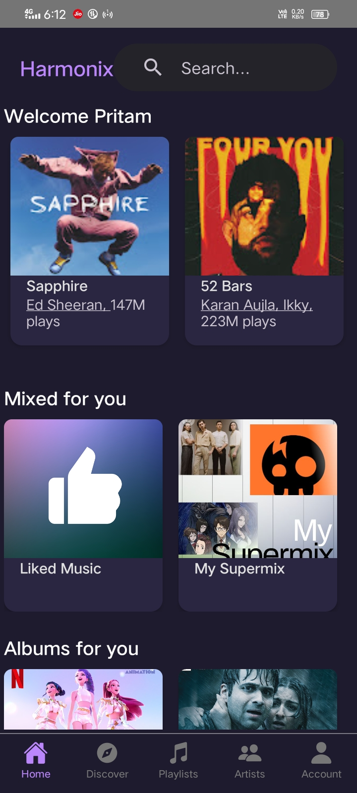 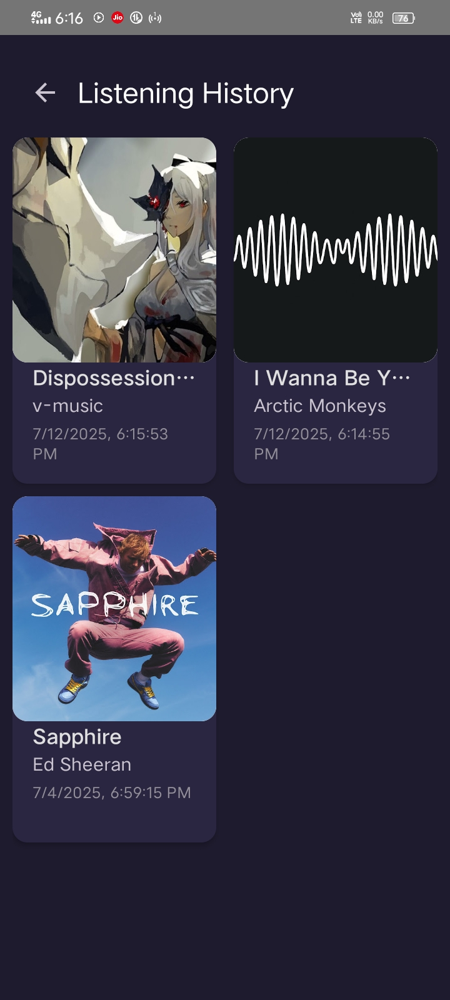 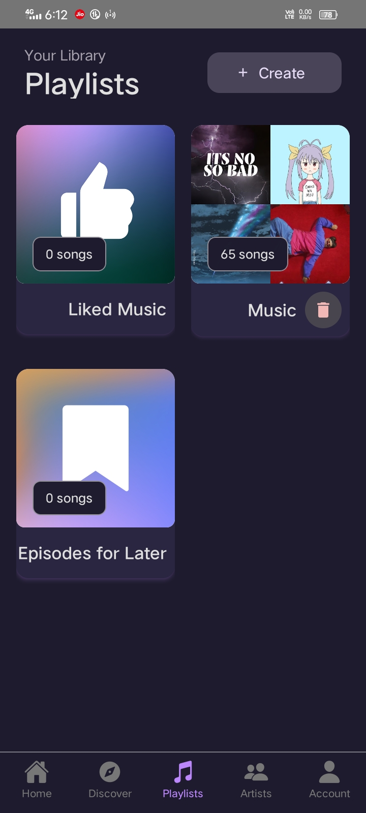 </p> <p align="center"> 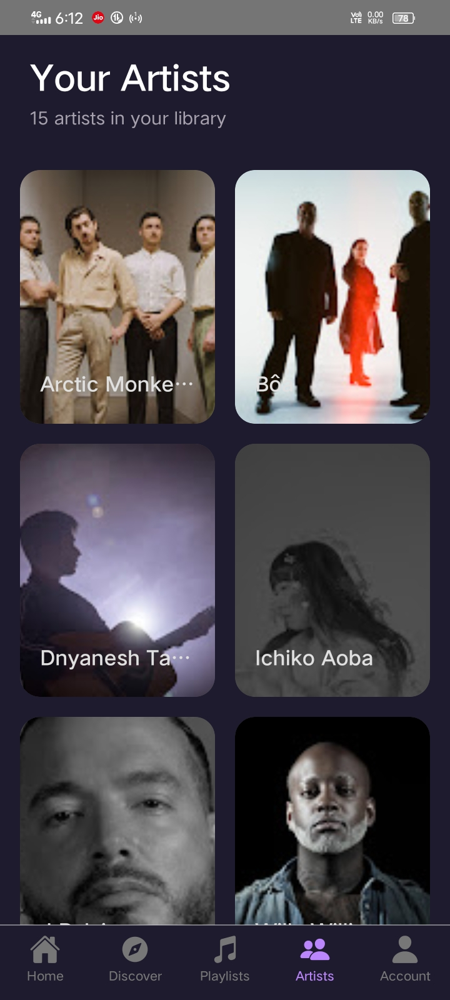 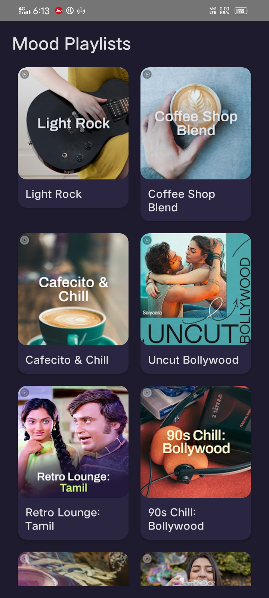  </p>

<p align="center"> 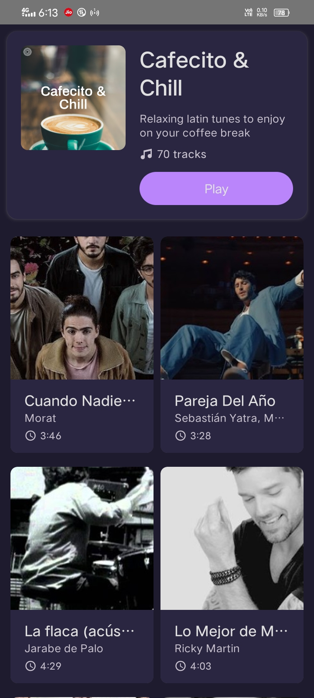 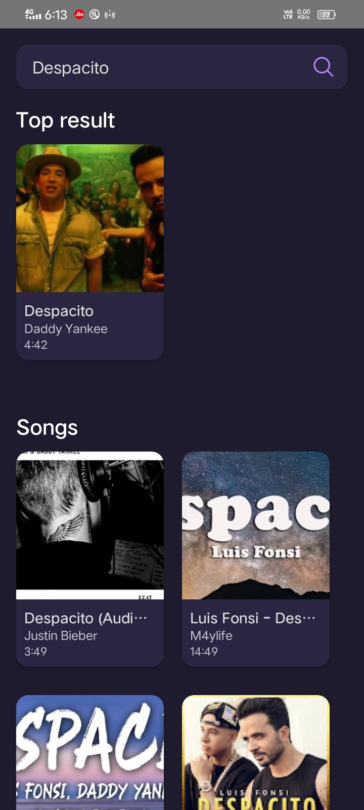 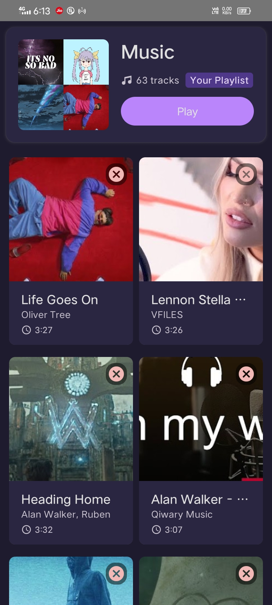 </p> <p align="center"> 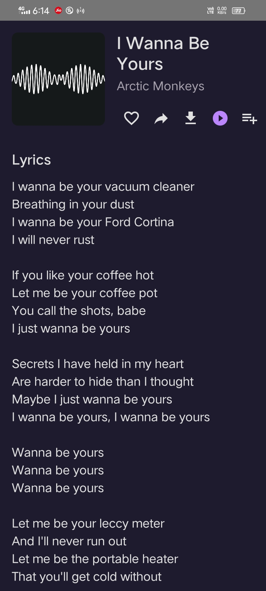 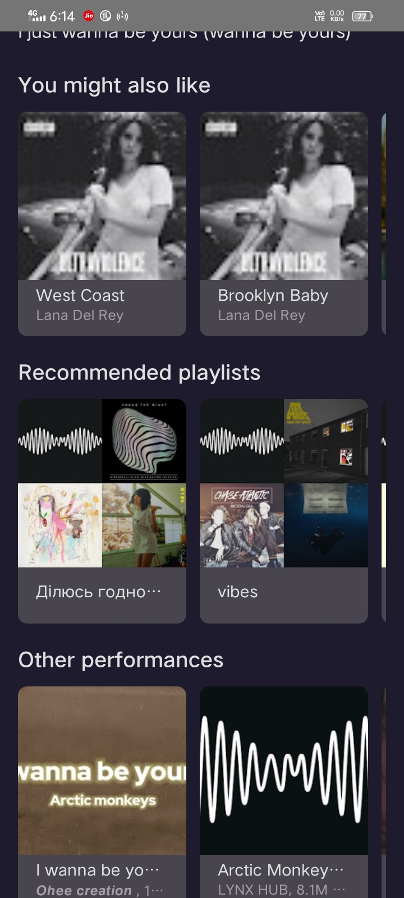 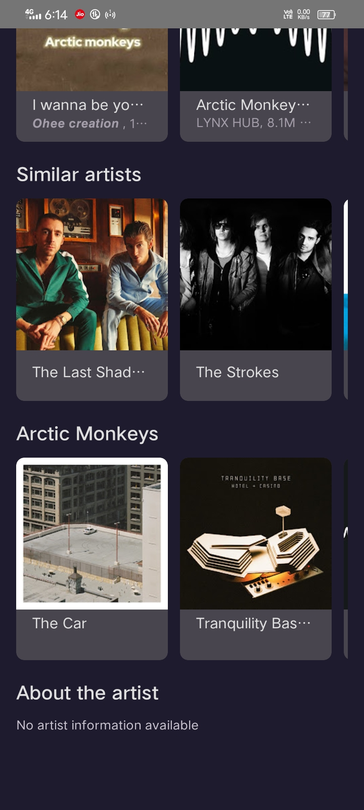 </p>

<p align="center"> 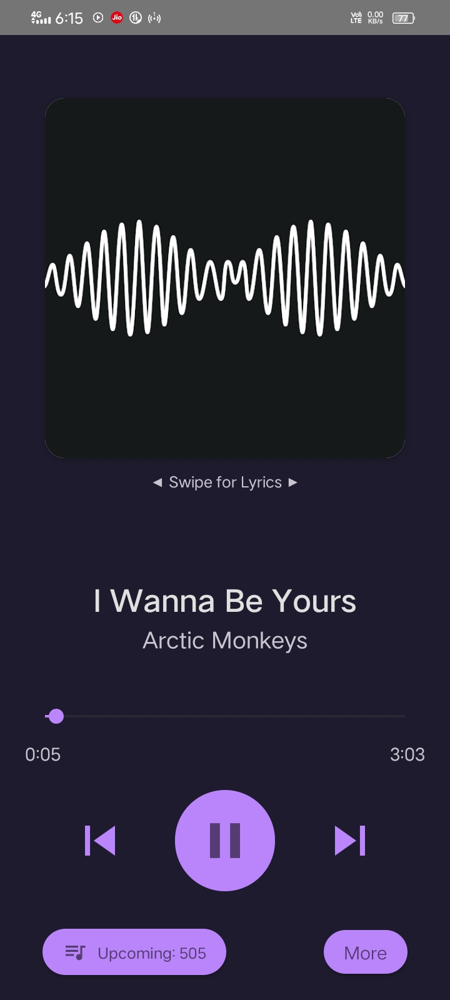 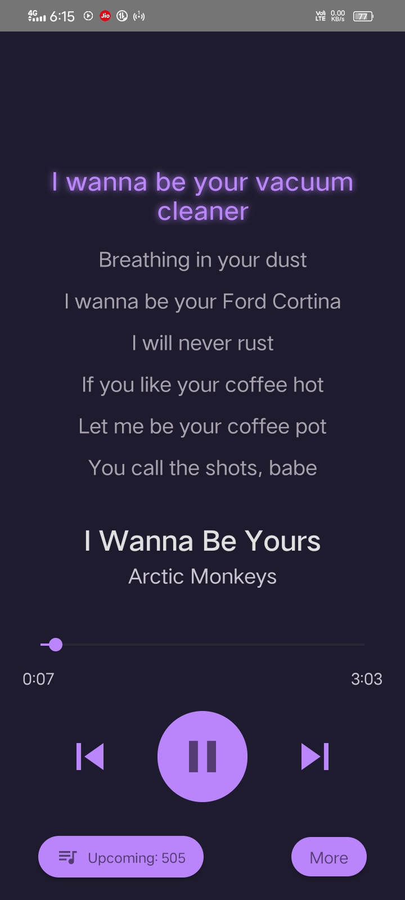 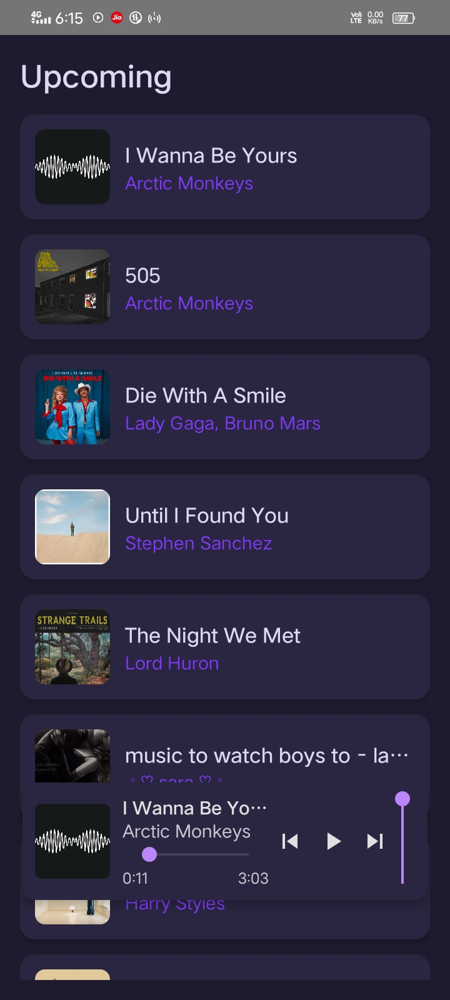 </p> <p align="center">  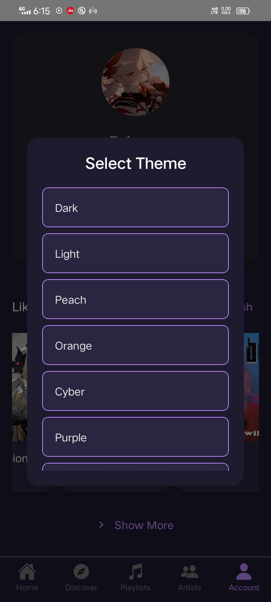 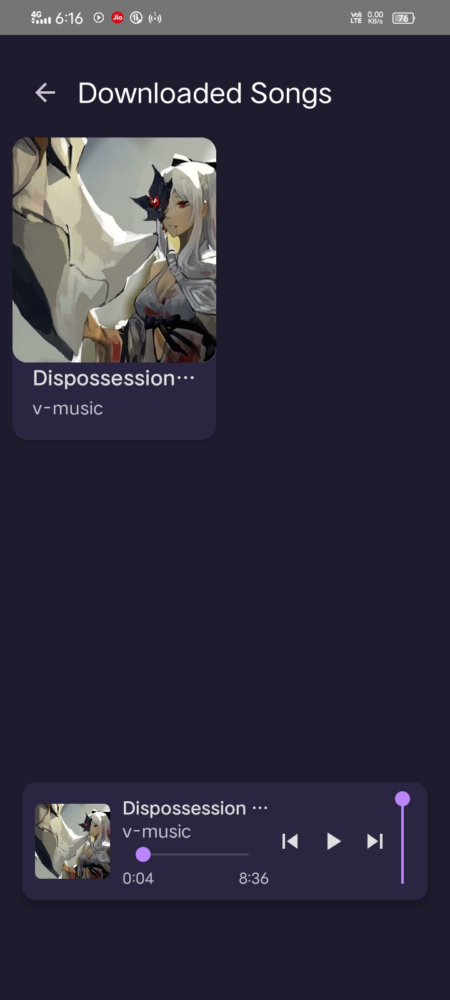 </p>

⚠️ Legal Notice

This project uses unofficial YouTube Music APIs:

❌ Not affiliated with YouTube or Google

❌ Not licensed for distribution or resale

✅ Intended only for learning, personal, and non-commercial use


> Do not upload Harmonix to any app store or distribute APKs.


---

📜 License

Source code is licensed under the MIT License.
Use of YouTube Music content must comply with YouTube’s Terms of Service.


Feedback and pull requests welcome for educational improvements.

